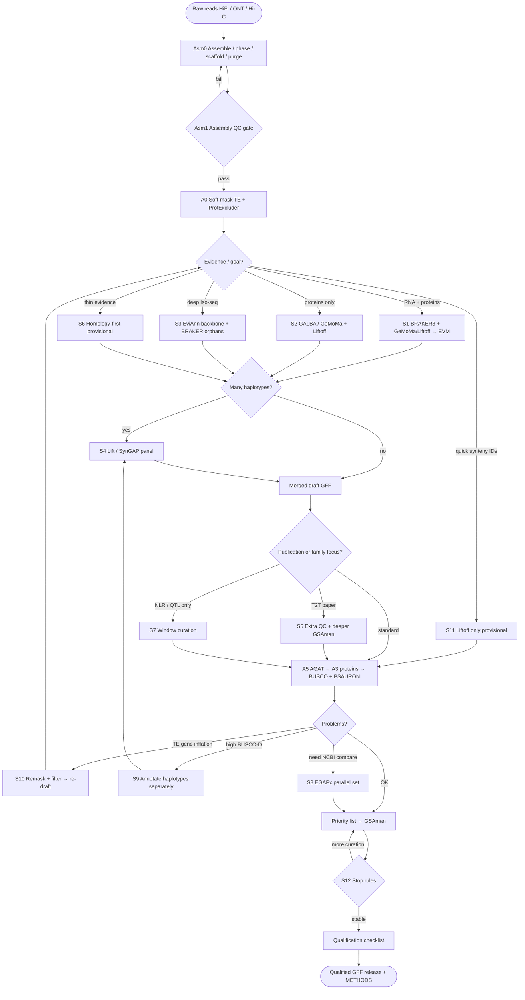

# vitis-gene-annotation

Full path: **genome assembly → branched annotation routes → qualified GFF**.

| Doc | |
|-----|--|
| **[`docs/DETAILED_GUIDE.md`](docs/DETAILED_GUIDE.md)** | **Every step detailed (commands + outputs)** |
| **[`docs/TOOLS.md`](docs/TOOLS.md)** | **How to install & use each tool** |
| [`docs/PLAYBOOK.md`](docs/PLAYBOOK.md) | Spine + qualification checklist |
| [`docs/SCENARIOS.md`](docs/SCENARIOS.md) | S1–S12 step-by-step how to annotate |
| [`docs/FULL_PIPELINE.md`](docs/FULL_PIPELINE.md) | Stage index |
| [`docs/PEER_PIPELINES.md`](docs/PEER_PIPELINES.md) | Blueprints |

**Tool order (S1):** hifiasm → YaHS → BUSCO(genome) → ProtExcluder → RepeatMasker → HISAT2/STAR → BRAKER3 → GeMoMa/Liftoff → EVM → AGAT/gffread → BUSCO+PSAURON → GSAman → re-QC/release.  Full table: [`docs/TOOLS.md`](docs/TOOLS.md).


## Branch flowchart



## Default line (most projects)

`Asm0 → Asm1 → A0 → S1 → AGAT/BUSCO/PSAURON → GSAman (priority) → qualified release`

```bash
cp config/example.env config/local.env
set -a && source config/local.env && set +a
# Follow docs/SCENARIOS.md S1 after assembly + soft-mask
```

## This is not

- Not a HiFi assembler package — Asm0 is a hand-off checklist  
- Not TE-only — [vitis-te](https://github.com/Xuzhen-Li/vitis-te)  
- Not graphs — [vitis-pangenome](https://github.com/Xuzhen-Li/vitis-pangenome)

No private FASTQ/BAM in git.

**Author:** Xuzhen Li · [ORCID](https://orcid.org/0000-0003-3670-6657)
