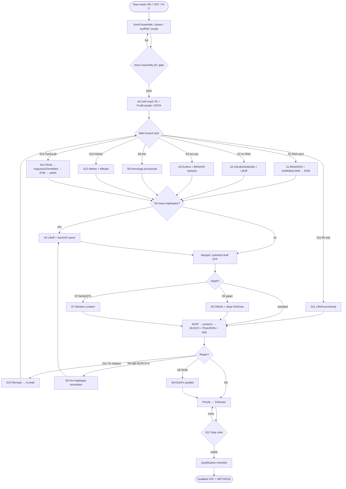

# vitis-gene-annotation

Full path: **genome assembly → main branched process → qualified GFF**.

| Doc | |
|-----|--|
| **[`docs/steps/MAIN.md`](docs/steps/MAIN.md)** | **Main process (all branches on one spine)** |
| **[`docs/AI_ASSIST.md`](docs/AI_ASSIST.md)** | **AI co-pilot: prompts, data, order, checks** |
| **[`docs/DETAILED_GUIDE.md`](docs/DETAILED_GUIDE.md)** | Step commands (S1 default + branch deltas) |
| **[`docs/TOOLS.md`](docs/TOOLS.md)** | Tool install & use |
| [`docs/SCENARIOS.md`](docs/SCENARIOS.md) | S1–S14 recipes |
| [`docs/steps/dclab/`](docs/steps/dclab/) | **S14 CantuLab EVM (merged)** |
| [`docs/PLAYBOOK.md`](docs/PLAYBOOK.md) | Qualification checklist |
| [`docs/PEER_PIPELINES.md`](docs/PEER_PIPELINES.md) | Blueprints |

**Tool order (S1):** hifiasm → YaHS → BUSCO(genome) → EDTA/ProtExcluder → RepeatMasker → HISAT2/STAR → **BRAKER4 (or BRAKER3)** → GeMoMa/Liftoff → EVM → AGAT → BUSCO+PSAURON → GSAman → release.  
**S14 order:** repeats → PASA → train Augustus/GeneMark → predict → EVM → PASA polish → filter → rename → same QC/GSAman/release.

## Branch flowchart (main process)



## Default lines

- **Modern default:** `Asm0 → Asm1 → A0 → S1 → QC → GSAman → release`  
- **CantuLab grape METHODS:** `Asm0 → Asm1 → A0 → S14 → QC → GSAman → release`  
- **AI helping:** [`docs/AI_ASSIST.md`](docs/AI_ASSIST.md)

```bash
cp config/example.env config/local.env
set -a && source config/local.env && set +a
```

## This is not

- Not a HiFi assembler package — Asm0 is a hand-off checklist  
- Not TE-only — [vitis-te](https://github.com/Xuzhen-Li/vitis-te)  
- Not graphs — [vitis-pangenome](https://github.com/Xuzhen-Li/vitis-pangenome)

No private FASTQ/BAM in git.

**Author:** Xuzhen Li · [ORCID](https://orcid.org/0000-0003-3670-6657)
