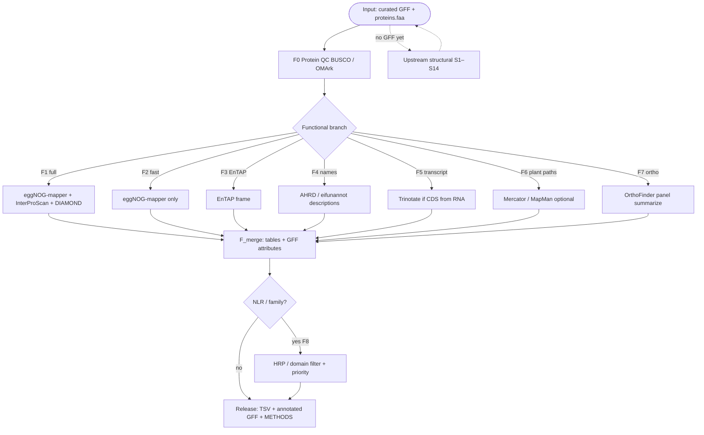

# vitis-gene-annotation

**Main product: functional annotation** of *Vitis* gene sets  
(GO / KEGG / domains / readable names / pathway summaries).

This is a standalone teaching / METHODS playbook. Cite tools and papers you use ([`docs/CITATIONS.md`](docs/CITATIONS.md)); it is not a mirror of another lab’s repo.

Structural annotation (finding gene models) is **upstream input**, documented under `docs/steps/` so you can produce or accept a qualified GFF+proteins — then this repo’s primary spine starts.

| Doc | |
|-----|--|
| [`docs/RECENT_HIGH_QUALITY.md`](docs/RECENT_HIGH_QUALITY.md) | Allowlisted journals only (Cell+ / MP PC PBJ HR MBE NAR GB) |
| **[`docs/INSTALL_FUNCTIONAL.md`](docs/INSTALL_FUNCTIONAL.md)** | **Install DBs + tools (start here)** |
| **[`docs/steps/FUNCTIONAL_MAIN.md`](docs/steps/FUNCTIONAL_MAIN.md)** | **Main process — functional** |
| **[`docs/FUNCTIONAL_GUIDE.md`](docs/FUNCTIONAL_GUIDE.md)** | Functional steps + commands |
| **[`docs/SCENARIOS_FUNCTIONAL.md`](docs/SCENARIOS_FUNCTIONAL.md)** | F1–F8 situations |
| **[`docs/AI_ASSIST.md`](docs/AI_ASSIST.md)** | AI co-pilot (prompts / data / checks) |
| [`docs/steps/MAIN.md`](docs/steps/MAIN.md) | Upstream structural spine (S1–S14) |
| [`docs/TOOLS.md`](docs/TOOLS.md) | Tools (functional section first) |
| [`docs/RELATED_SOFTWARE.md`](docs/RELATED_SOFTWARE.md) | Related tools (further reading) |
| [`docs/CITATIONS.md`](docs/CITATIONS.md) | Papers / software to cite |

## Main flowchart (functional)



## Start here (copy-paste)

1. [`docs/INSTALL_FUNCTIONAL.md`](docs/INSTALL_FUNCTIONAL.md)
2. [`docs/SCENARIOS_FUNCTIONAL.md`](docs/SCENARIOS_FUNCTIONAL.md) **F1**
3. `bash pipeline/F_release.sh`
4. Why this stack: [`docs/RECENT_HIGH_QUALITY.md`](docs/RECENT_HIGH_QUALITY.md)

## Default line

`proteins.faa` (+ optional GFF) → **F1** (emapper + InterProScan + SwissProt DIAMOND) → merge → release under `work/function/`.

```bash
cp config/example.env config/local.env   # set PROTEINS_FA, optional DRAFT_GFF/CURATED_GFF
set -a && source config/local.env && set +a
# docs/SCENARIOS_FUNCTIONAL.md F1
```

## This is not

- Not primarily a gene-finder package — use upstream S1–S14 or bring your own GFF  
- Not TE-only — [vitis-te](https://github.com/Xuzhen-Li/vitis-te)  
- Not graphs — [vitis-pangenome](https://github.com/Xuzhen-Li/vitis-pangenome)

No private FASTQ/BAM in git.

**Author:** Xuzhen Li · [ORCID](https://orcid.org/0000-0003-3670-6657)
