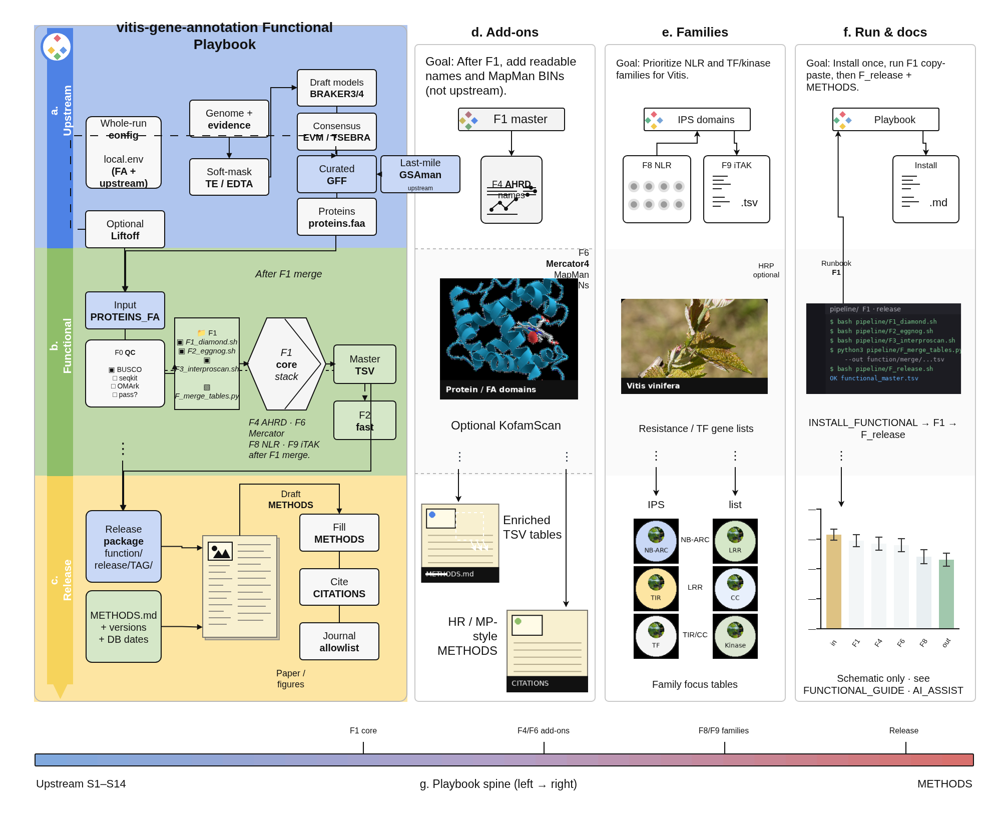
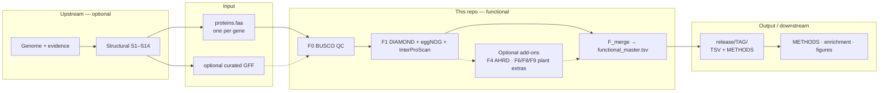

# gene-function-annotation

**Main product: functional annotation** of gene sets across biology  
(GO / KEGG / domains / readable names / pathway summaries).

Organism-general teaching / METHODS playbook (not grape-only, not plant-only). Core spine is eukaryote-friendly; *Vitis* / plant paths are **worked examples and optional add-ons**. Set `GENOME_PREFIX`, `FUN_PREFIX`, BUSCO lineage, and eggNOG tax scope for your species or clade. Cite tools and papers you use ([`docs/CITATIONS.md`](docs/CITATIONS.md)); it is not a mirror of another lab’s repo.

Structural annotation (finding gene models) is **upstream input**, documented under `docs/steps/` so you can produce or accept a qualified GFF+proteins — then this repo’s primary spine starts.

> Formerly `vitis-gene-annotation`. Pair with [`gene-structure-annotation`](https://github.com/Xuzhen-Li/gene-structure-annotation) for gene models.

| Doc | |
|-----|--|
| [`docs/RECENT_HIGH_QUALITY.md`](docs/RECENT_HIGH_QUALITY.md) | Allowlisted journals only (Cell+ / MP PC PBJ HR MBE NAR GB) |
| **[`docs/INSTALL_FUNCTIONAL.md`](docs/INSTALL_FUNCTIONAL.md)** | **Install DBs + tools (start here)** |
| **[`docs/steps/FUNCTIONAL_MAIN.md`](docs/steps/FUNCTIONAL_MAIN.md)** | **Main process — functional** |
| **[`docs/FUNCTIONAL_GUIDE.md`](docs/FUNCTIONAL_GUIDE.md)** | Functional steps + commands |
| **[`docs/SCENARIOS_FUNCTIONAL.md`](docs/SCENARIOS_FUNCTIONAL.md)** | F1–F8 situations |
| **[`docs/AI_ASSIST.md`](docs/AI_ASSIST.md)** | AI co-pilot (prompts / data / checks) |
| [`gene-structure-annotation`](https://github.com/Xuzhen-Li/gene-structure-annotation) | Upstream structural spine (S1–S14) |
| [`docs/TOOLS.md`](docs/TOOLS.md) | Tools (functional section first) |
| [`docs/RELATED_SOFTWARE.md`](docs/RELATED_SOFTWARE.md) | Related tools (further reading) |
| [`docs/CITATIONS.md`](docs/CITATIONS.md) | Papers / software to cite |
| [`docs/METHODS_FUNCTIONAL.md`](docs/METHODS_FUNCTIONAL.md) | METHODS paragraph template |

## Inputs → outputs (read this first)

| | What | Where |
|--|------|--------|
| **Upstream** (optional) | Structural annotation → gene models | sibling [`gene-structure-annotation`](https://github.com/Xuzhen-Li/gene-structure-annotation) (S1–S14), *or* bring your own release |
| **Input (required)** | One representative protein per gene | `PROTEINS_FA` → usually `$WORK_DIR/proteins.faa` |
| **Input (optional)** | Curated GFF for locus context | `CURATED_GFF` / `DRAFT_GFF` in `config/local.env` |
| **This repo (main)** | Functional annotation F0–F9 | [`docs/steps/FUNCTIONAL_MAIN.md`](docs/steps/FUNCTIONAL_MAIN.md) |
| **Output (primary)** | Gene-centric function table | `$WORK_DIR/function/merge/functional_master.tsv` |
| **Output (release)** | Packaged TSV + proteins + METHODS stub | `$WORK_DIR/function/release/<TAG>/` via `pipeline/F_release.sh` |
| **Downstream** | Paper METHODS, enrichment, MapMan figures, NLR lists | fill [`docs/METHODS_FUNCTIONAL.md`](docs/METHODS_FUNCTIONAL.md); optional F4/F6/F8/F9 tables beside the master TSV |

**Not claimed yet:** automatic write-back of GO/KEGG into GFF column 9 (master TSV is the source of truth).

## Overview figure



Editable source: [`docs/figures/functional_overview.drawio`](docs/figures/functional_overview.drawio)  
(style tokens aligned with the Co-Scientist architecture figure: pastel bands, Helvetica cards, black orthogonal arrows).

## Text flowchart (fallback)



Alternate fast path: **F2** (emapper only). Alternate frames: **F3** EnTAP, **F5** Trinotate, **F7** OrthoFinder then F1 on OG reps — see [`docs/SCENARIOS_FUNCTIONAL.md`](docs/SCENARIOS_FUNCTIONAL.md).

## Start here (copy-paste)

1. [`docs/INSTALL_FUNCTIONAL.md`](docs/INSTALL_FUNCTIONAL.md)
2. [`docs/SCENARIOS_FUNCTIONAL.md`](docs/SCENARIOS_FUNCTIONAL.md) **F1** (then F4; plant papers often + F6)
3. `bash pipeline/F_release.sh`
4. Why this stack: [`docs/RECENT_HIGH_QUALITY.md`](docs/RECENT_HIGH_QUALITY.md)

## Default line

**In:** `proteins.faa` (+ optional GFF)  
**Run:** **F1** (SwissProt DIAMOND + eggNOG-mapper + InterProScan) → merge  
**Out:** `work/function/merge/functional_master.tsv` → `work/function/release/<TAG>/`

```bash
cp config/example.env config/local.env   # set PROTEINS_FA, optional DRAFT_GFF/CURATED_GFF
set -a && source config/local.env && set +a
# docs/SCENARIOS_FUNCTIONAL.md F1
```

## This is not

- Not primarily a gene-finder package — use [`gene-structure-annotation`](https://github.com/Xuzhen-Li/gene-structure-annotation) or bring your own GFF  
- Not TE-only — use a clade-appropriate TE library (grape example: [vitis-te](https://github.com/Xuzhen-Li/vitis-te))  
- Not graphs / pangenomes — separate playbooks (grape example: [vitis-pangenome](https://github.com/Xuzhen-Li/vitis-pangenome))

No private FASTQ/BAM in git.

**Author:** Xuzhen Li · [ORCID](https://orcid.org/0000-0003-3670-6657)
