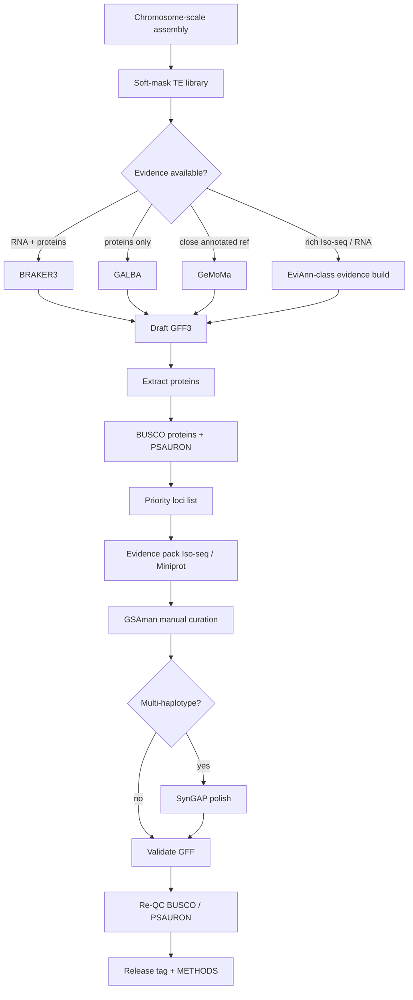

# Full *Vitis* gene-structure annotation pipeline

End-to-end path from assembly to a curated, versioned GFF3.
Draft engines are documented in
[plant-gene-annotation](https://github.com/Xuzhen-Li/plant-gene-annotation);
last-mile QC and curation live in **this** repo.



## Stage map

| Stage | Where | What |
|-------|--------|------|
| A0 Soft-mask | [vitis-te](https://github.com/Xuzhen-Li/vitis-te) + [`pipeline/A0_softmask.md`](../pipeline/A0_softmask.md) | Soft-mask only; keep NLR/R-genes out of TE lib |
| A1 Choose engine | [`pipeline/A1_choose_engine.md`](../pipeline/A1_choose_engine.md) | BRAKER3 / GALBA / GeMoMa / EviAnn |
| A2 Run draft | [`pipeline/A2_run_draft.sh`](../pipeline/A2_run_draft.sh) | Produce `DRAFT_GFF` |
| A3 Proteins from GFF | [`pipeline/A3_proteins_from_gff.sh`](../pipeline/A3_proteins_from_gff.sh) | One protein per gene for QC |
| 01 QC | [`pipeline/01_qc_busco_psauron.sh`](../pipeline/01_qc_busco_psauron.sh) | BUSCO + PSAURON |
| 02 Priority | [`pipeline/02_priority_loci.py`](../pipeline/02_priority_loci.py) | Triage list |
| 03 Evidence | [`pipeline/03_evidence_checklist.md`](../pipeline/03_evidence_checklist.md) | Tracks for the browser |
| 04 GSAman | [`pipeline/04_gsaman_curation.md`](../pipeline/04_gsaman_curation.md) | Fix four error classes |
| 05 SynGAP | [`pipeline/05_syngap_polish.md`](../pipeline/05_syngap_polish.md) | Optional multi-hap polish |
| 06 Release | [`pipeline/06_release_gff.md`](../pipeline/06_release_gff.md) | Versioned public GFF |

Config: [`config/example.env`](../config/example.env).

## Honest scope

- Full-genome manual curation is person-months + Iso-seq (rice MH63 >10k loci).
- For *Vitis*, finish A0–A3 + 01–02 on the whole genome; run 03–04 on **priority families / QTL windows** first.
- Do not hard-mask before prediction. Do not feed Metazoa OrthoDB to Vitis BRAKER3.
- TE work stays in `vitis-te`. Graph / PAV stays in `vitis-pangenome`.

## Suggested first run (one haplotype)

```bash
cp config/example.env config/local.env   # edit paths
set -a && source config/local.env && set +a

# A0: soft-masked FASTA already prepared (see A0_softmask.md)
# A1–A2: draft
bash pipeline/A2_run_draft.sh
# A3 + last mile
bash pipeline/A3_proteins_from_gff.sh
bash pipeline/01_qc_busco_psauron.sh
python3 pipeline/02_priority_loci.py -i "$PSAURON_TSV" -o "$PRIORITY_TSV"
# then GSAman on priority.tsv → curated GFF → 06_release
```

Peers and citations: [`ATTRIBUTION.md`](ATTRIBUTION.md).
