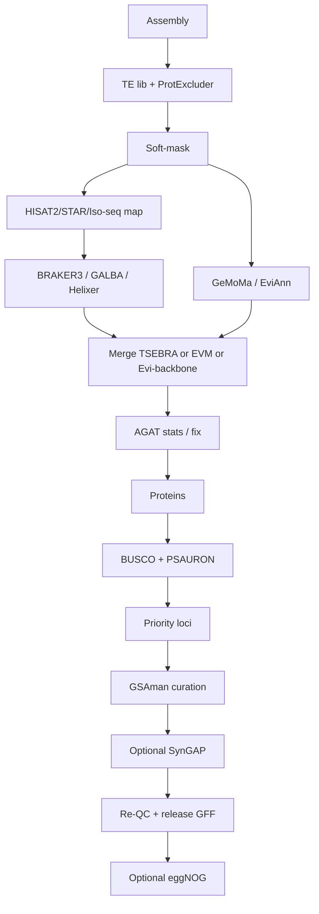

# Full *Vitis* gene-structure annotation pipeline

Soft-mask → RNA → dual draft → merge → AGAT → BUSCO/PSAURON → GSAman → release.

Peers: [`PEER_PIPELINES.md`](PEER_PIPELINES.md).

## Stage table

| Stage | Doc / script | Peer idea |
|-------|----------------|-----------|
| A0 Soft-mask | [`../pipeline/A0_softmask.md`](../pipeline/A0_softmask.md) | Krabbenhoft 1–3, vitis-te |
| A0b Clean TE lib | [`../pipeline/A0b_protexcluder.md`](../pipeline/A0b_protexcluder.md) | ProtExcluder |
| A1 Engine choice | [`../pipeline/A1_choose_engine.md`](../pipeline/A1_choose_engine.md) | plant-gene-annotation skill |
| A1b RNA align | [`../pipeline/A1b_rna_align.md`](../pipeline/A1b_rna_align.md) | Krabbenhoft / Sylvan |
| A2 Primary draft | [`../pipeline/A2_run_draft.sh`](../pipeline/A2_run_draft.sh) | BRAKER3 / GALBA / GeMoMa / EviAnn |
| A2b Second set | [`../pipeline/A2b_second_predictor.md`](../pipeline/A2b_second_predictor.md) | GeMoMa / EviAnn / Helixer |
| A4 Merge | [`../pipeline/A4_merge_sets.sh`](../pipeline/A4_merge_sets.sh) | TSEBRA / EVM / keen-laras |
| A5 AGAT | [`../pipeline/A5_agat_stats.sh`](../pipeline/A5_agat_stats.sh) | AGAT |
| A3 Proteins | [`../pipeline/A3_proteins_from_gff.sh`](../pipeline/A3_proteins_from_gff.sh) | — |
| 01–02 QC / priority | `01` `02` | GSAman Methods |
| 03–04 Evidence / GSAman | `03` `04` | GSAman; baozg NLR warning |
| 05 SynGAP | `05` | SynGAP |
| 06 Release | `06` | Sylvan TidyGFF idea |
| A6 Function | [`../pipeline/A6_functional_optional.md`](../pipeline/A6_functional_optional.md) | eggNOG |

## Recommended *Vitis* default path

1. Soft-mask with curated TE lib (A0 / A0b).  
2. Map RNA (A1b).  
3. **BRAKER3** (OrthoDB eudicots/Viridiplantae) + **GeMoMa** from PN40024 (or EviAnn if Iso-seq is deep).  
4. Merge with **EVM** (BRAKER+GeMoMa) or **TSEBRA** (two BRAKER-family sets) or **evi_backbone**.  
5. AGAT stats → proteins → BUSCO + PSAURON → priority list.  
6. GSAman on NLR / stilbene / QTL windows first (tandem collapse).  
7. Release versioned GFF; then optional eggNOG.

## Honest scope

- Full manual curation is expensive — prioritize families (baozg + GSAman).  
- Templates in `A2` / `A4` need your cluster module lines.  
- No private FASTQ/BAM in git.

Config: [`../config/example.env`](../config/example.env).
