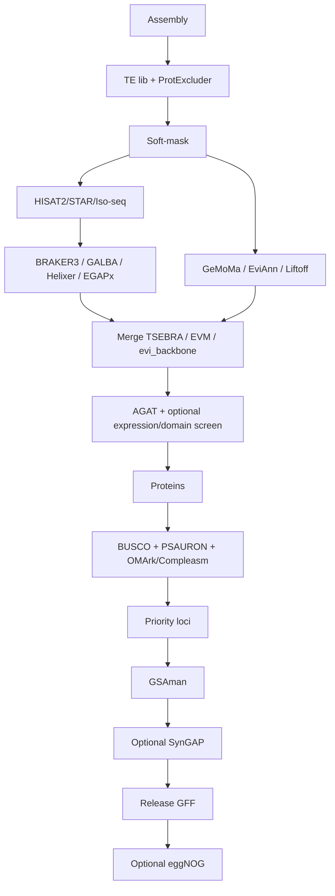

# Stage reference

**Human entry point:** [`PLAYBOOK.md`](PLAYBOOK.md) (complete flow + scenario index).  
**Situations:** [`SCENARIOS.md`](SCENARIOS.md).

## Stage table

| Stage | Path |
|-------|------|
| A0 / A0b | `pipeline/A0_softmask.md` · `A0b_protexcluder.md` |
| A1 / A1b | `A1_choose_engine.md` · `A1b_rna_align.md` |
| A2 / A2b / A2c / A2d | draft · second · Liftoff · EGAPx |
| A4 | `A4_merge_sets.sh` |
| A5 / A5b / A5c | AGAT · OMArk/compleasm · GetaFilter-style |
| A3 | `A3_proteins_from_gff.sh` |
| 01–06 | last mile |
| A6 | functional optional |

Default *Vitis*: BRAKER3 + GeMoMa/Liftoff → EVM → AGAT → BUSCO/PSAURON → GSAman (NLR-first).
