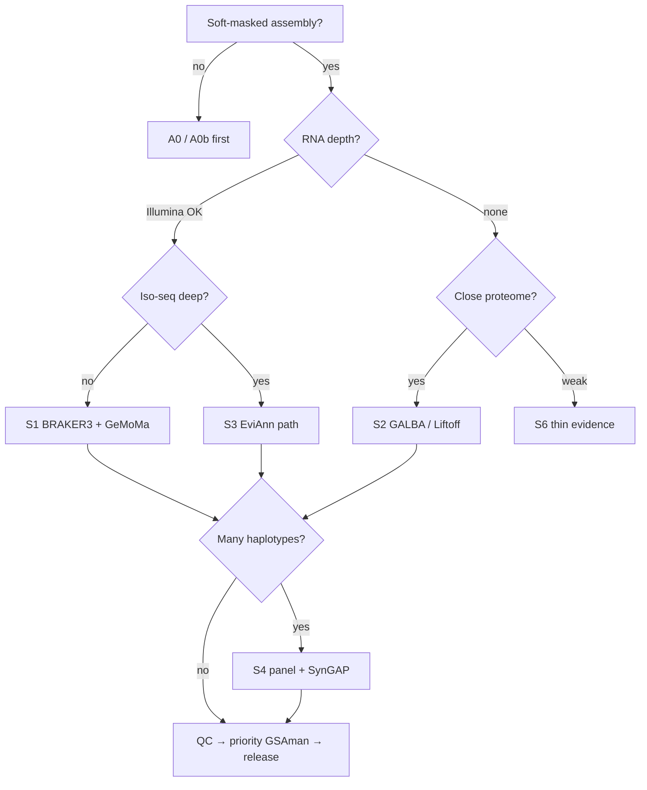

# *Vitis* gene annotation playbook

One map for the whole lab grain: **what to run**, **in what order**, and **which recipe fits your evidence**.

| Doc | Role |
|-----|------|
| **This file** | Complete flow + scenario index |
| [`SCENARIOS.md`](SCENARIOS.md) | Situation → recipe (detailed) |
| [`FULL_PIPELINE.md`](FULL_PIPELINE.md) | Stage table + mermaid |
| [`ERROR_CLASSES.md`](ERROR_CLASSES.md) | Four structural failure modes |
| [`PEER_PIPELINES.md`](PEER_PIPELINES.md) | Upstream blueprints |
| [`ATTRIBUTION.md`](ATTRIBUTION.md) | Citations |

Config: [`../config/example.env`](../config/example.env).

---

## 1. Complete default flow (one haplotype)

Use when you have **Illumina RNA + proteins** and a soft-masked assembly.

```text
A0  Soft-mask (vitis-te lib; ProtExcluder / no NLR in TE lib)
A1b Map RNA (HISAT2 or STAR) → RNA_BAM
A2  BRAKER3 (OrthoDB eudicots/Viridiplantae + BAM)
A2b GeMoMa or Liftoff from PN40024 → DRAFT_GFF_B
A4  Merge MERGE_MODE=evm (or tsebra if both BRAKER-family)
A5  AGAT stats / light fix
A3  Representative proteins (gffread)
01  BUSCO (proteins) + PSAURON
A5b Optional OMArk / Compleasm
02  Priority loci (low PSAURON + NLR/stilbene boost)
03  Evidence pack for browser
04  GSAman on priority only (first pass)
05  Optional SynGAP if ≥2 haplotypes curated
06  Re-QC → versioned GFF + METHODS
A6  Optional eggNOG (after structure stable)
```

```bash
cp config/example.env config/local.env   # edit
set -a && source config/local.env && set +a

# After soft-mask + RNA + wired A2/A2b on the cluster:
bash pipeline/A4_merge_sets.sh
bash pipeline/A5_agat_stats.sh "$MERGED_GFF"
export DRAFT_GFF="$MERGED_GFF"
bash pipeline/A3_proteins_from_gff.sh
bash pipeline/01_qc_busco_psauron.sh
python3 pipeline/02_priority_loci.py -i "$PSAURON_TSV" -o "$PRIORITY_TSV"
# → GSAman (04) → 06_release_gff.md
```

**Honest scope:** whole-genome GSAman is person-months. Default is **genome-wide auto + targeted curation**.

---

## 2. Scenario picker (short)

| Your situation | Go to | One-line recipe |
|----------------|-------|-----------------|
| RNA + broad proteins | [S1](SCENARIOS.md#s1-rna--proteins-default) | BRAKER3 + GeMoMa/Liftoff → EVM → GSAman |
| Proteins only (close relatives) | [S2](SCENARIOS.md#s2-proteins-only) | GALBA or GeMoMa/Liftoff → light merge → QC |
| Deep Iso-seq / FLNC | [S3](SCENARIOS.md#s3-deep-iso-seq) | EviAnn primary; BRAKER orphans; evi_backbone |
| Many haplotypes / cultivars | [S4](SCENARIOS.md#s4-haplotype-panel) | Curate one ref → Liftoff/GeMoMa → SynGAP |
| T2T / gap-free claim | [S5](SCENARIOS.md#s5-t2t--publication-grade) | Default + hard QC + broader GSAman |
| Thin RNA, distant proteins | [S6](SCENARIOS.md#s6-thin-evidence) | GeMoMa/Liftoff first; BRAKER secondary; heavy curation |
| NLR / stilbene / QTL focus | [S7](SCENARIOS.md#s7-family--qtl-first) | Skip full-genome hand edit; window-first |
| NCBI / GenBank-oriented | [S8](SCENARIOS.md#s8-ncbi-style-parallel) | EGAPx parallel set; compare, don’t blindly replace |
| Polyploid / high BUSCO-D | [S9](SCENARIOS.md#s9-polyploid--high-busco-d) | Check ploidy before purging |
| Dirty TE / gene inflation | [S10](SCENARIOS.md#s10-te-orf-inflation) | Remask + ProtExcluder; GetaFilter-style screen |
| Only need lift for synteny | [S11](SCENARIOS.md#s11-quick-homologous-lift) | Liftoff only; label provisional |
| After draft looks “good enough” | [S12](SCENARIOS.md#s12-stop-rules) | Stop rules / when not to keep iterating |

Decision sketch:



---

## 3. Non-negotiables (all scenarios)

1. Soft-mask only before prediction — never hard-mask.  
2. Keep NLR / R-genes out of the TE library.  
3. OrthoDB / protein DB: **Viridiplantae or eudicots**, not Metazoa.  
4. Do not auto-delete low-FPKM defense / secondary-metabolism genes.  
5. No private FASTQ/BAM in this git repo.  
6. Draft engines may stay as cluster templates until wired (`A2`, `A4`).

---

## 4. Stage cheat-sheet

| ID | Script / doc |
|----|----------------|
| A0 | `pipeline/A0_softmask.md` |
| A0b | `pipeline/A0b_protexcluder.md` |
| A1 | `pipeline/A1_choose_engine.md` |
| A1b | `pipeline/A1b_rna_align.md` |
| A2 | `pipeline/A2_run_draft.sh` |
| A2b | `pipeline/A2b_second_predictor.md` |
| A2c | `pipeline/A2c_liftoff.md` |
| A2d | `pipeline/A2d_egapx_optional.md` |
| A4 | `pipeline/A4_merge_sets.sh` |
| A5 | `pipeline/A5_agat_stats.sh` |
| A5b | `pipeline/A5b_omark_compleasm.sh` |
| A5c | `pipeline/A5c_expression_pfam_filter.md` |
| A3 | `pipeline/A3_proteins_from_gff.sh` |
| 01–06 | QC → priority → evidence → GSAman → SynGAP → release |
| A6 | `pipeline/A6_functional_optional.md` |
